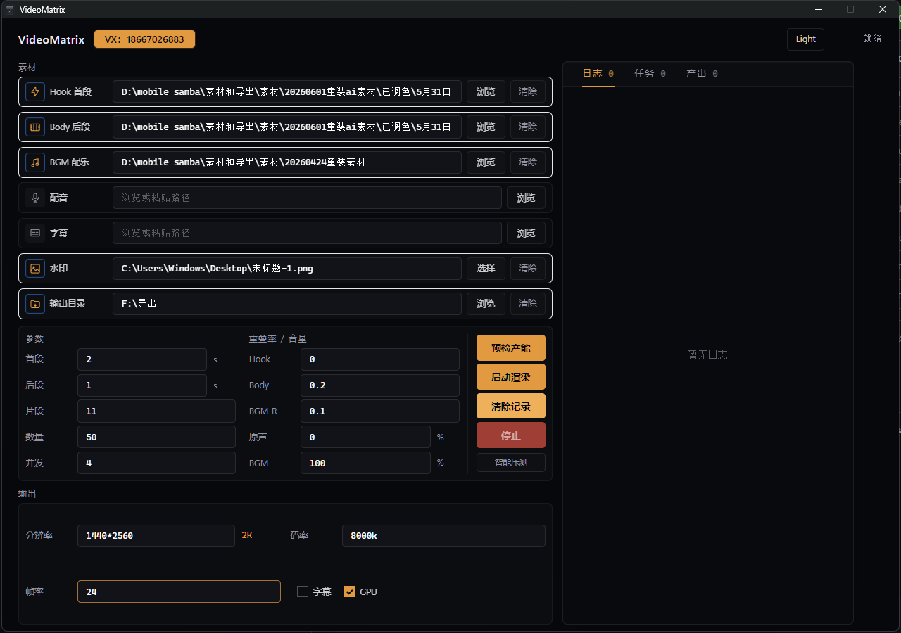
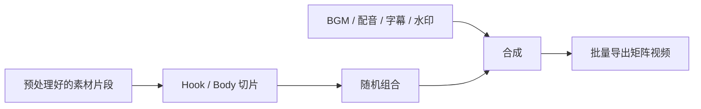
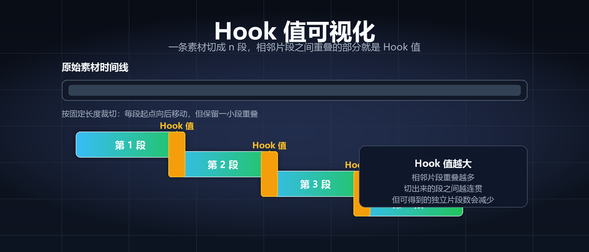

# VideoMatrix


短视频矩阵自动化混剪工具。这个软件主要面向需要大量信息流素材、抖音千川素材、服装/电商花絮素材、Hook 测试素材的人，用来把原始片段自动裁剪、乱序拼接、加 BGM、加配音、加字幕、加水印，并批量导出多条视频。

它不是通用剪辑软件，也不负责调色、构图、美化画面。它更像一个“素材矩阵生成器”：把你已经预处理好的素材批量重组，解决人工纯混剪效率低的问题。



## 下载

请到 Releases 下载最新安装包：

[https://github.com/w2968066/VideoMatrix--/releases](https://github.com/w2968066/VideoMatrix--/releases)

| 平台 | 文件 |
| --- | --- |
| Windows | `VideoMatrix.Setup.2.0.0.exe` |
| macOS | `VideoMatrix.Setup.2.0.0-mac.dmg` |

安装包已内置后端服务和 FFmpeg / FFprobe。Windows 用户直接安装即可，不需要单独安装 Python 或配置环境变量。

## 适合谁

适合：

- 需要大量短视频素材做信息流投放的人。
- 需要批量测试不同 Hook、不同卖点排序的人。
- 有很多服装、产品、模特花絮、口播、细节镜头素材的人。
- 希望把 1 条素材拆成多条“结构不同”的素材用于测试的人。

不适合：

- 只想做单条精剪视频的人。
- 需要复杂转场、精细包装、调色、特效设计的人。
- 没有大量乱序拼接需求的人。

## 它能做什么



主要能力：

- 批量裁剪视频片段。
- Hook 首段和 Body 后段分开管理。
- 自动乱序拼接，生成多条不同组合的视频。
- 支持同文件夹纯混剪。
- 支持 Hook 和 Body 分文件夹组合。
- 支持总文件夹下多子文件夹批量处理。
- 支持 BGM、配音、字幕、水印，包括 GIF 水印。
- 支持 GPU 加速。实际速度取决于素材、分辨率、显卡和并发设置。
- 支持预检产能和智能压测。
- 支持历史记录，避免重复使用已经用过的片段。

## 使用前预处理

软件只负责裁剪、拼接、加 BGM、加配音、加字幕、加水印。原素材建议先在剪映或其他剪辑软件里预处理。

推荐流程：

1. 设置草稿分辨率和帧率，例如 `1080*1920`、`30` 帧。
2. 把所有素材片段拖进时间线。
3. 完成调色、画面大小、构图、基础包装等处理。
4. 全选时间线片段。
5. 右键导出所有片段。
6. 注意不是导出整条时间线，而是导出每个片段。

这样得到的素材更适合交给 VideoMatrix 批量混剪。

## 核心概念

### Hook

Hook 是视频开头片段。一般短视频前 2 到 3 秒不一样，对很多投放场景来说就已经是不同的视频结构。

Hook 值可以理解为相邻切片之间允许重叠的比例：



- Hook 值越大，相邻片段重叠越多。
- Hook 值越大，可切出的独立片段数量越少。
- Hook 设置为 `1` 时，接近重复使用模式，适合固定强 Hook 去搭配不同后段。

### Body

Body 是后段素材。它负责承接 Hook 后面的内容，可以是卖点、产品细节、花絮、场景、模特动作、口播辅助画面等。

Body 会在单条成片内部尽量避免重复画面，但跨视频可以复用，适合大量组合。

## 用法 1：纯混剪

用于解决素材量不足的问题。

设置方式：

- Hook 和 Body 共用同一个文件夹。
- 把原来的多个片段自动调换顺序。
- 一条素材可以扩展出多条不同组合的视频。

适合场景：

- 服装类目拍了很多段模特花絮。
- 产品细节、场景素材、空镜素材比较多。
- 想快速生成几十条或上百条素材。

建议：

- Hook 重叠率可以从 `0` 或 `0.1` 开始。
- Body 重叠率不要太高，`0.3` 通常已经偏高。
- 重叠率越高，重复利用的片段越多，素材差异会变小。

多款处理：

- 每个款式单独放一个子文件夹。
- 再把这些子文件夹放到一个总文件夹。
- 软件选择总文件夹后会自动处理所有子文件夹。
- 导出结果也会按 Hook 子文件夹分类。

## 用法 2：不同 Hook 搭配后段

用于解决不同开头素材的拼接工作。

设置方式：

- Hook 和 Body 使用不同文件夹。
- Hook 放你要测试的开头。
- Body 放后段素材或卖点素材。
- Hook 重叠率设置为 `1`，让强 Hook 可以重复搭配不同后段。

适合场景：

- 你有多个不同开头，需要快速产出测试素材。
- 后段只是卖点排序或产品画面，变化要求没那么高。
- 一个 Hook 需要生成 10 条、20 条不同后段组合，用来提高测试机会。

目的：

- 给强 Hook 配足够的素材。
- 避免只有一条素材导致 Hook 再好也不一定排得上流量。
- 快速测试不同后段承接方式。

## 用法 3：水印、字幕、配音

水印、字幕、配音都有独立路径。

可结合上面两种用法使用：

- 加品牌水印。
- 加 GIF 动态水印。
- 加字幕文件。
- 加讲解配音。
- 加 BGM 或调整原声音量。

## 路径说明

- Hook、Body、BGM、配音、字幕、水印、输出目录都有独立路径。
- Hook 和 Body 支持总文件夹下子文件夹分类。
- 多款素材建议按子文件夹整理。
- 导出会按 Hook 子文件夹分类。
- 输出目录不是必填，不填会使用默认输出逻辑。

## 设置说明

### 历史记录

软件会记住哪些 Hook 片段用过。没剪完下次继续时，它会尽量避开已经用过的片段。

不要随便点“清除记录”。清除后，之前用过的片段会重新进入可用池。

### 预检产能

点击预检产能后，软件会按当前参数估算最多能剪出多少条。

如果你设置的生成数量超过可用产能，开始渲染时会按预检产能自动降低，避免强行生成失败。

### 智能压测

智能压测会测试当前电脑在不同并发数下的渲染速度，并给出建议并发。

这个结果和当时电脑剩余性能有关。如果你同时开了很多软件，压测结果会变低。

### GPU

开启 GPU 后会优先调用 NVIDIA 硬件编码。是否能明显加速取决于显卡、素材规格、分辨率和并发数。

例如 12 秒视频素材在合适配置下可以做到几秒生成一条，但这不是固定承诺。

## 本地运行

开发环境运行：

```powershell
cd backend
python app.py

cd ../frontend
npm install
npm run dev
```

## 云端构建

仓库包含 Windows 和 macOS 构建 workflow：

```text
.github/workflows/build-windows.yml
.github/workflows/build-mac.yml
```

可以在 GitHub Actions 页面手动运行，并指定 Release tag。构建完成后会自动上传安装包到对应 Release。

## 本地运行数据

程序可能生成以下配置、缓存或历史文件：

```text
config.json
usage_history.json
media_cache.json
ffmpeg_error_log.txt
```

这些属于本地运行状态，不建议提交到仓库。

## 许可

本项目源代码采用 MIT License。FFmpeg / FFprobe 相关二进制组件遵循其各自许可协议，二次分发时请遵守 FFmpeg 项目的许可要求。
