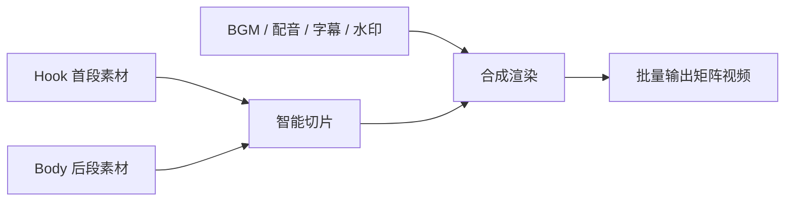

# VideoMatrix

<p align="center">
  
</p>

短视频矩阵自动化混剪工具。它把 1.5.1 版稳定的 Python / FFmpeg 混剪核心，升级为带桌面界面的 Electron 应用，适合批量生成去重短视频素材。


## 下载

请到 Releases 下载最新版本：

[https://github.com/w2968066/VideoMatrix--/releases](https://github.com/w2968066/VideoMatrix--/releases)

| 平台 | 文件 |
| --- | --- |
| Windows | `VideoMatrix.Setup.2.0.0.exe` |
| macOS | `VideoMatrix.Setup.2.0.0-mac.dmg` |
| 历史 Python 单文件版 | `VideoMatrix1.5.1.exe` |

新版安装包会内置后端服务和 FFmpeg / FFprobe，不需要用户单独安装 Python 或配置环境变量。

## 软件能做什么

VideoMatrix 用于把多组短视频素材自动拆片、随机组合、去重输出。典型流程是：



核心目标：

- 批量生成不同组合的视频。
- 降低首段重复使用概率。
- 自动复用后段素材，提高产能。
- 支持多文件夹矩阵任务。
- 自动处理帧率、音频采样率、水印和 FFmpeg 编码细节。

## 主要功能

### 素材路径

- Hook 首段、Body 后段、BGM、配音、字幕、水印、输出目录独立配置。
- 支持手动粘贴长路径。
- 支持点击按钮选择文件或文件夹。
- 路径前图标可直接打开已设置目录。

### 参数设置

- 首段时长、后段时长、总片段时长。
- 生成数量、并发数。
- Hook / Body 重叠率。
- 原声音量、BGM 音量、BGM 随机音量。
- 分辨率、码率、帧率。
- 字幕开关、GPU 编码开关。

### 任务控制

- 预检产能：提前估算素材可生成数量。
- 智能压测：测试当前机器适合的并发渲染能力。
- 启动渲染：批量生成视频。
- 停止：中断当前任务。
- 清除记录：清理历史去重记录。

### 结果反馈

- 日志、任务、产出分 Tab 显示。
- 产出列表显示单条视频耗时。
- 支持从产出列表打开生成结果。
- 任务完成后弹出明显提醒。

## 1.5.1 核心混剪逻辑

### Hook 首段素材池

- 按设定阈值步长顺序切片。
- 每个切片写入唯一使用记录 `usage_history.json`。
- 生成时先随机洗牌，再不放回抽取，降低重复。
- 去重阈值为 `1.0` 时进入无限复用模式。

### Body 后段素材池

- 按步长顺序切片入池。
- 单条成片内部使用 `random.sample`，避免同条视频内重复画面。
- 跨视频全局调度采用放回复用，后段池不会枯竭。

### 智能矩阵路由

| 场景 | 逻辑 |
| --- | --- |
| Hook 与 Body 选择同一父目录 | 子文件夹内部自产自销 |
| Hook 与 Body 不同父目录但有同名子文件夹 | Hook A 对应 Body A |
| Body 是普通单一文件夹 | 多个 Hook 子文件夹共享同一个 Body 池 |

底层扫描使用递归目录扫描，支持多层子文件夹。

### FFmpeg 处理

- 优先使用 NVIDIA `h264_nvenc`。
- 不支持 GPU 时自动降级到 `libx264`。
- 支持 `29.94`、`29.97`、`30000/1001` 等非整数帧率。
- 使用视频轨时长，避免音频尾巴导致黑屏。
- 拼接前统一帧率、采样率和音频格式。
- 静态图片水印自动循环，并随主视频结束截断。

## 使用步骤

1. 准备 Hook 首段、Body 后段、BGM、配音、字幕、水印等素材。
2. 在界面粘贴路径或点击按钮选择路径。
3. 设置时长、数量、并发、重叠率、音量、分辨率、码率和帧率。
4. 点击预检产能或智能压测。
5. 点击启动渲染。
6. 在产出 Tab 查看结果和耗时。

输出目录不是强制必填。未填写时，程序沿用原版默认输出逻辑。

## 本地运行

新版桌面端分为后端和前端：

```powershell
cd backend
python app.py

cd ../frontend
npm install
npm run dev
```

历史 1.5.1 Python 版：

```powershell
python AutoVideoMatrix1.5.1.py
```

源码运行时，请确保 `ffmpeg.exe` 和 `ffprobe.exe` 能在程序目录或系统 `PATH` 中找到。

## 云端构建

仓库包含 Windows 和 macOS 构建 workflow：

```text
.github/workflows/build-windows.yml
.github/workflows/build-mac.yml
```

可以在 GitHub Actions 页面手动运行，并指定 Release tag。构建完成后会自动上传安装包到对应 Release。

## 本地打包

新版 Electron 安装包：

```powershell
cd frontend
npm run dist
```

历史 1.5.1 单文件版：

```powershell
pyinstaller -F -w AutoVideoMatrix1.5.1.py
```

分发时请保留 `ffmpeg.exe` 和 `ffprobe.exe`，不需要 `ffplay.exe`。

## 本地运行数据

程序可能生成以下配置、缓存或历史文件：

```text
config.json
usage_history.json
media_cache.json
ffmpeg_error_log.txt
```

这些属于本地运行状态，不建议提交到仓库。

## 许可

本项目源代码采用 MIT License。FFmpeg / FFprobe 相关二进制组件遵循其各自许可协议，二次分发时请遵守 FFmpeg 项目的许可要求。
