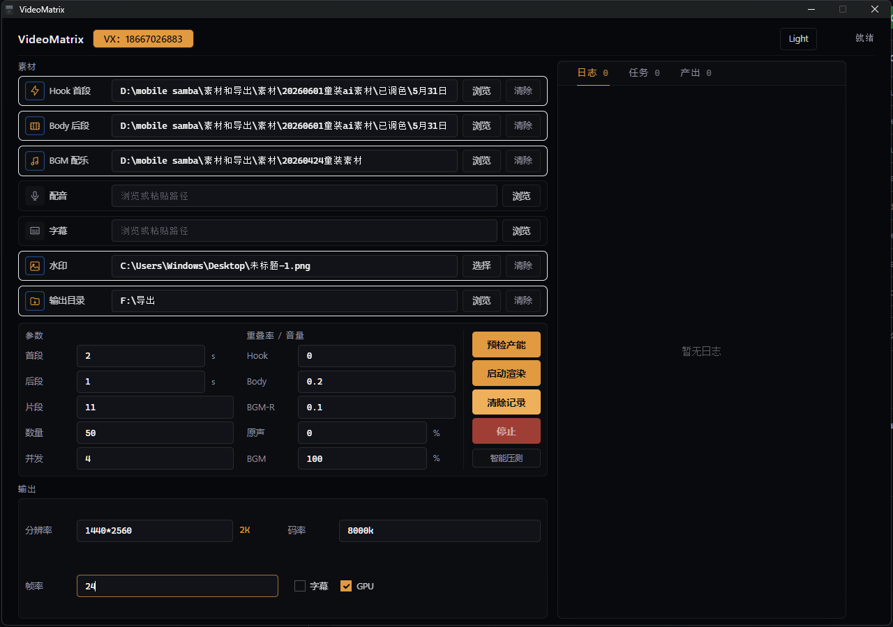
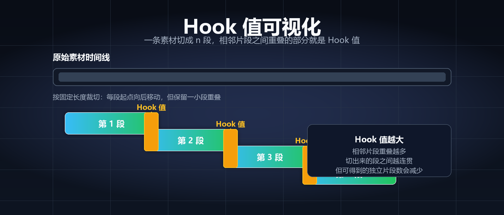

# VideoMatrix


短视频矩阵自动化混剪工具。这个软件主要面向需要大量信息流素材、抖音千川素材、服装/电商花絮素材、Hook 测试素材的人，用来把原始片段自动裁剪、乱序拼接、加 BGM、加配音、加字幕、加水印，并批量导出多条视频。

它不是通用剪辑软件，也不负责调色、构图、美化画面。它更像一个“素材矩阵生成器”：把你已经预处理好的素材批量重组，解决人工纯混剪效率低的问题。



## 下载

### v2.5.0 更新公告（2026-10-01）

#### 新功能与用法

- **三轨配乐**：全片 BGM、Hook BGM、Body BGM 可以同时使用。全片从视频开头播放，Hook 配乐只覆盖首段，Body 配乐从首段结束后播放；各轨独立设置音量、渐入渐出、循环或播完停止、播放起点及裁切重叠率。点击“＋Hook 配乐”“＋Body 配乐”添加，移除后保留设置供下次恢复。
- **按全片 BGM 时长**：只根据随机选中的完整全片音乐决定长度，不受 Hook / Body 配乐影响。Body 自动补齐或裁尾；Hook 已超过音乐时保留 Hook 并提示。成品 Hook 不会再改变已配置的配乐轨道。
- **可看内容的目录选择器**：选择文件夹时显示内部文件，支持系统原生缩略图、列表和详细信息；可按名称、修改时间、类型、大小排序，收藏常用目录，新建文件夹，前进、后退及刷新。
- **文件管理**：双击打开，右键支持定位、复制完整路径、改名及批量移入回收站。Ctrl / Command、Shift 用于管理多选，Body 素材仍以勾选框为准；F2 改名，Delete 移入回收站，F5 刷新。删除需确认，只使用系统回收站，不会降级成永久删除。

#### 修复与优化

- 修复选目录时无法确认里面的素材的问题；缩略图仅加载可见文件，不通过 FFmpeg 抽帧。
- 改名后同步软件内相关素材路径、输出路径、收藏与目录勾选；删除成功后移除相应引用。同名目标不会被覆盖，文件扩展名保留。
- 混剪运行或排队时禁止删改文件；后端状态无法确认时也会阻止操作。回收站部分失败会显示原因并保留失败项目。
- 修复目录切换后快捷键偶尔失效的焦点问题，并统一深浅色目录浏览样式。
- 兼容旧配乐配置：保留原音乐及音量；旧“仅 Body＋按 BGM 时长”会提示恢复按片段数量，选择全片音乐后可重新启用时长模式。

下载：[v2.5.0 正式版](https://github.com/w2968066/VideoMatrix--/releases/tag/v2.5.0)。详细用法：[三轨配乐](docs/bgm-three-tracks.md)、[目录浏览与文件管理](docs/directory-browser.md)。Windows 10/11 x64；macOS Apple Silicon ARM64。Mac 包未进行 Apple 开发者签名及公证，系统可能提示安全限制；完整桌面使用仍需 Mac 实机反馈。

### v2.4.0 更新公告（2026-09-28）

#### 新功能与用法

- **BGM 可选**：留空即可不加背景音乐，Hook / Body 原声和配音仍按各自音量设置输出；全部关闭时允许无声输出并提示。填入失效路径会报错，不会静默忽略。
- **按完整 BGM 时长混剪**：选择 BGM 后点击“按 BGM 时长”，每条输出随机选一条完整音频，只有一条就使用该条，从头播放到尾。Body 超长自动裁尾，不足按组顺序继续随机补齐，生成日志说明调整；素材不足会提示，不无限重复同一切片。输出数量仍由“数量”决定。
- **保持成品 Hook 保护**：BGM“Body 开”时，总时长为 Hook + BGM；“Body 关”时以 BGM 作为全片目标时长。Hook 已达到或超过 BGM 时保留 Hook、不追加 Body，并提示音乐覆盖情况，仍可生成。插入随机首帧会额外增加一帧并后移音频。
- **完整 Body 原片**：普通 Body 后段及每个分组均可勾选“按原素材时长”，随机使用完整视频；忽略对应固定秒数和裁切重叠率，段数保留。不同组可混用完整原片与固定秒数；按 BGM 时长生成时尾段仍会裁短对齐音频。界面显示预计时长范围，实际时长写入日志。
- **内置帮助**：“联系我”左侧新增“简易教程”，涵盖普通、分组、完整音乐、成品 Hook 和多款批量用法；各主要设置旁的小问号可点击查看说明，支持 Esc 和点击外部关闭。
- **输出默认值**：1080×1920、8000k、30 fps、GPU 勾选；已有保存的参数不强制覆盖。随机首帧旁新增红色“建议打开”，仍为独立可选功能。

#### 修复与优化

- 修复浅色模式下路径、参数、分组输入框及消息提示仍为深色的问题。
- 修复查看历史日志时被新日志强制拉回底部：向上滚动后保持位置，手动回到底部恢复跟随，切换标签也保留阅读位置。
- Hook、普通 Body、分组 Body 的原素材时长开关统一为勾选框；BGM、配音、字幕、水印统一用小号橙色“可选”标注。
- 清空 BGM 自动恢复按片段数量生成，保留原手动参数；未选择 BGM 时点击时长模式会提示并定位到路径输入框。
- 成片变换按实际 Body 时长处理，避免完整原片及音频裁尾后仍沿用固定段长。没有 Body 时跳过仅作用于 Body 的字幕、配音、水印处理。

下载： [v2.4.0 正式版](https://github.com/w2968066/VideoMatrix--/releases/tag/v2.4.0)。Windows 包面向 Windows 10/11 x64；macOS 包为 Apple Silicon（ARM64），不是 Intel 通用包。macOS 较旧系统兼容性未完整验证。

### v2.3.2 更新公告（2026-09-24）

- 桌面后端使用系统分配的空闲端口，避免固定 8765 端口与其他软件冲突。
- 启动时验证后端版本和本次启动身份；安装不完整、版本不符或启动失败时直接提示。
- 修复后端日志未接入界面的问题：渲染时可在右侧日志查看 `[加速]`、`[加速降级]` 和底层失败原因；清空日志后不会重复刷回。
- 关闭窗口时停止任务并清理本实例后台进程；桌面异常退出时后端也会监听断开并退出。
- GPU 开关改为探测可用硬件编码：Windows 尝试 NVIDIA / Intel / AMD，macOS 使用 VideoToolbox；不可用时提示原因并继续 CPU 编码。混剪、成品变换和随机封面共用任务级编码会话，资源不足时降低并发重试。
- 优化长素材裁切定位，合并成品变换与混剪编码，避免重复执行变换。字幕等软件滤镜仍可能占用 CPU，具体速度取决于素材和设备。
- 修复智能压测污染正式素材使用记录、将失败任务计入性能成绩的问题；压测覆盖混剪及开启的后处理环节。

使用方法：安装新版后正常打开即可，端口自动选择。勾选“GPU”并启动渲染，在右侧“日志”查看 `[加速]` / `[加速降级]`；如果仍未启用硬件编码，可直接复制相关日志用于排查，无需执行 PowerShell 命令。GPU 支持以本机探测结果为准，并非所有环节都由 GPU 执行。

请到 Releases 下载最新安装包：

[https://github.com/w2968066/VideoMatrix--/releases](https://github.com/w2968066/VideoMatrix--/releases)

| 平台 | 文件 |
| --- | --- |
| Windows x64 | `VideoMatrix.Setup.2.5.0.exe` |
| macOS ARM64 | `VideoMatrix.Setup.2.5.0-mac.dmg` |

安装包已内置后端服务和 FFmpeg / FFprobe。Windows 用户直接安装即可，不需要单独安装 Python 或配置环境变量。

## v2.1.4 更新公告（2026-09-04）

### 字幕字体、字号与悬浮预览

- 内置思源黑体 Source Han Sans SC Regular，SRT 烧录无需另装字体；安装包包含字体及 SIL OFL 1.1 许可。
- 新增字号滑杆（画面高度的 `3%–9%`，默认 `5.6%`），以及“小 / 标准 / 大”快捷设置。
- 修复界面缩放后鼠标位置与滑杆竖线不一致的问题；位置与字号滑杆均已修正。
- 按住任一字幕滑杆时显示极简悬浮预览，拖动实时更新，松开即隐藏。
- 预览使用 10 个中文字“这是十个字的字幕示例”，较大字号自动换行；按当前输出比例展示大概的位置和大小。
- 保留原有混剪流程、素材和配置，字号设置自动保存。

### 使用方法

1. 选择 SRT 字幕目录，确认字幕为“已开启”。
2. 通过顶部 / 中央 / 底部预设或位置滑杆调整位置。
3. 通过小 / 标准 / 大预设或字号滑杆调整大小，按住滑杆即可查看示意。
4. 启动渲染，字幕按当前设置烧录到成品；SRT 原文件不变。

> 悬浮框是位置和大小示意，不是成品预览。真实字幕长度、换行及字体排版以实际输出为准。

## v2.3.0 更新公告（2026-09-21）

### 按原素材时长使用 Hook

- 新增“按原素材时长”开关，开启后 Hook 文件整段作为首段参与混剪，不再按固定秒数裁切。适合 Hook 文件夹中的视频长度不一致、希望逐条保留原始开头的场景。
- Hook 按随机顺序轮换，一轮内每个文件使用一次；用完后重新洗牌开始下一轮。并发渲染也遵循每轮不重复。
- 开启时首段时长输入框置灰，Hook 重叠率固定为 `1`；关闭后恢复原首段时长和重叠率设置。
- 普通和 Body 分组模式均适用。成片长度随选中的 Hook 改变，界面读取 Hook 原素材时长并显示预计成片时长范围。
- 字幕、BGM、配音、水印及成品 Hook 保护的起始位置均按本条实际 Hook 时长计算。

### 界面说明与修复

- 重叠率问号弹窗改为解释“原素材的裁切重叠率”，用 0% 和 30% 示例展示切片起点及复用区间，图例和说明分开展示。
- 顶部联系方式默认隐藏微信号，可通过眼睛图标显示或收起。
- 增大窗口最小高度，输出参数在默认窗口中可见。

### 使用方法

1. 选择包含多个 Hook 视频的文件夹，并按正常方式设置 Body、BGM 和其他参数。
2. 勾选 Hook 时长旁的“按原素材时长”。首段固定时长会停用，Hook 重叠率设为 `1`。
3. 确认界面显示的预计成片时长范围，然后启动渲染。
4. 软件随机轮换完整 Hook；每一轮使用完文件夹中的全部 Hook 后，再重新随机排序。

## v2.2.0 更新公告（2026-09-11）

### Body 分组与随机首帧

- Body 支持普通 / 分组两种模式；分组模式最多 4 组，每组独立选择文件夹、设置抽取数量和单片段时长。
- 输出顺序固定为 `Hook → Body 1 → Body 2 → Body 3 → Body 4`，每组内部随机抽取。
- 界面自动显示包含 Hook 的总片段数和预计总时长；切换普通模式时原有 Body 设置保留。
- 新增独立“随机首帧”开关：从每条成品自身随机抽帧并随机缩放裁切。
- 支持“替换首帧”和“插入一帧”两种方式。替换不改变时长；插入会增加一帧并同步后移音频。
- 随机首帧与成品变换互不依赖，处理失败会保留原成片。

详细行为见 [`docs/body-groups-and-cover.md`](docs/body-groups-and-cover.md)。

## v2.1.3 更新公告（2026-09-03）

### 字幕位置自定义

- 字幕开启后，在字幕素材行下方显示位置控制。
- 新增顶部、中央、底部三个快捷位置预设。
- 新增 `8%–92%` 垂直位置滑块，可在预设基础上精细调整。
- 字幕位置使用画面比例保存，切换 1080P、2K 或横竖屏输出时保持相对位置。
- 默认保持底部字幕；位置配置会随其他混剪参数自动保存。

### 使用方法

1. 选择字幕目录并确认字幕状态为“已开启”。
2. 点击顶部、中央或底部快速定位。
3. 使用“上—下”滑块微调，右侧百分比表示字幕在画面中的垂直位置。
4. 启动渲染，字幕会按当前设置烧录到成品中。

## v2.1.2 更新公告（2026-09-03）

### 字幕功能修复

- 选择字幕目录后自动开启字幕，不再出现目录已选但渲染未生效的情况。
- 字幕素材行新增“已开启 / 已关闭”开关，字幕状态与目录放在同一位置管理。
- 清空字幕目录时自动关闭字幕；手动输入有效目录时自动开启。
- 字幕开启但目录无效、没有 SRT，或 SRT 无有效时间轴时，渲染前直接提示错误，不再静默输出无字幕视频。

### 使用方法

1. 点击字幕行右侧“浏览”，选择包含 `.srt` 文件的目录。
2. 软件会自动将字幕状态切换为“已开启”。
3. 如需暂时停用字幕，点击字幕行的“已开启”按钮切换为“已关闭”。
4. 启动渲染；字幕配置异常时软件会明确提示原因。

## v2.1.1 更新公告（2026-09-03）

### Body 多目录选择

- Body 按钮改为“追加”，明确表示新目录不会覆盖已有目录。
- 支持在系统目录选择器中一次选择多个 Body 文件夹。
- 支持重复点击“追加”分批加入文件夹，并自动忽略重复目录。
- 每次选择后提示本次新增数量和 Body 目录总数。

## v2.1.0 更新公告（2026-08-26）

### 新功能

- 新增可选“去重变换”页签：混剪完成后再处理最终成品，关闭时原有混剪流程完全不变。
- 提供“轻度 / 标准 / 增强”三档强度；档位下方会持续显示用途说明，切换时也会弹出提示。
- 每个输出视频和内部片段使用独立随机参数，对构图、色彩、锐度、相邻帧和音频做小幅变化。
- 素材选择按钮会从该行当前目录或上次打开的目录开始浏览，不再统一跳到其他位置。

### 如何使用成品变换

1. 按原方式设置 Hook、Body、BGM、输出目录和混剪参数。
2. 打开右侧“去重变换”页签并开启开关。
3. 选择强度：“轻度”优先保持原构图，“标准”适合日常任务，“增强”的画面变化更明显。
4. 点击“启动渲染”。软件先完成原有混剪，再自动处理最终成品；Hook、Body 等源文件不会被修改。
5. 若变换处理失败，软件会保留原混剪成品，不会中断整批任务。

### 修复与改进

- 修复 Windows 文件短暂占用时遗留 `.variant-*.mp4`，导致设置产出 5 个却在目录看到更多视频的问题。
- 中间文件改用非视频扩展名，并增加替换重试与失败清理；最终目录只统计正式成品。
- 修复旧版隐藏的随机镜像配置可能继续影响新版的问题；新版默认不镜像。
- 修正素材效果按钮的含义和提示，使“仅 Body 生效”状态更容易理解。
- 改进预检运行状态、并发参数校验和错误反馈，避免重复点击或无提示等待。

> 成品变换是本地创意处理功能，不承诺任何平台的“首发”或识别结果。

## 适合谁

适合：

- 需要大量短视频素材做信息流投放的人。
- 需要批量测试不同 Hook、不同卖点排序的人。
- 有很多服装、产品、模特花絮、口播、细节镜头素材的人。
- 希望把 1 条素材拆成多条“结构不同”的素材用于测试的人。

不适合：

- 只想做单条精剪视频的人。
- 需要复杂转场、精细包装、调色、特效设计的人。
- 没有大量乱序拼接需求的人。

## 它能做什么


```mermaid
flowchart LR
  A["预处理好的素材片段"] --> B["Hook / Body 切片"]
  B --> C["随机组合"]
  D["BGM / 配音 / 字幕 / 水印"] --> E["合成"]
  C --> E
  E --> F["批量导出矩阵视频"]
```

主要能力：

- 批量裁剪视频片段。
- Hook 首段和 Body 后段分开管理。
- 自动乱序拼接，生成多条不同组合的视频。
- 支持同文件夹纯混剪。
- 支持 Hook 和 Body 分文件夹组合。
- 支持总文件夹下多子文件夹批量处理。
- 支持 BGM、配音、字幕、水印，包括 GIF 水印。
- 支持成品 Hook 模式，可让 BGM、配音、字幕、水印只从 Body 段开始生效。
- 支持 Hook 与 Body 分别设置原声音量，也支持直接使用视频文件的声音作为 BGM。
- 支持 GPU 加速。实际速度取决于素材、分辨率、显卡和并发设置。
- 支持预检产能和智能压测。
- 支持历史记录，避免重复使用已经用过的片段。
- 支持可选成品变换层：混剪完成后对最终成品进行构图、色彩、锐度、相邻帧及音频微调，并保持总时长、分辨率和帧率不变。
- 支持 Codex 等 Agent 打开软件、识别并填写 Hook / Body / BGM 等路径和混剪参数。

### 成品变换层

“去重变换”位于右侧独立页签，默认关闭，不改变原有混剪流程。开启后，软件先按原逻辑完成混剪，再处理最终成品；不会修改 Hook、Body 等源素材。

- 默认档位为“标准”，也可选择“轻度”或“增强”；界面会显示各档位说明。
- 每个输出及其内部片段使用独立随机参数。
- 相邻帧混合只使用这条成片自身的帧，不引入外部素材。
- 处理成功后才替换成片；处理失败会保留原成片并在日志中提示。
- Windows 文件短暂占用时会自动重试，临时文件不会作为额外视频产出。

## Agent 工作流

仓库包含独立的 `agent_adapter` 适配层和 VideoMatrix Skill。它们只调用现有桌面程序与后端，不另写混剪核心。

默认采用半自动模式：Agent 只打开 VideoMatrix，并把用户明确提供的素材路径和参数合并到软件上次设置；不会自动点击预检或开始渲染。只有用户明确要求“预检”或“直接开始”时，Agent 才会执行相应动作。

支持自然语言换算视频结构。例如：

```text
这个目录是 Hook，那个目录是 Body，整条 12 秒，首段 3 秒，使用默认配置打开软件。
```

适配层会填写 Hook `3` 秒、Body `1.8` 秒、总片段数 `6`，并使用竖屏 2K、`8000k`、`24fps`；用户检查后再手动开始。省略“使用默认配置”时，软件原有的时长、音量、分辨率和并发等设置保持不变。

一键接入本机 Codex：

```powershell
PowerShell -ExecutionPolicy Bypass -File agent_adapter/install_codex.ps1
```

详细命令与 MCP 工具见 [`agent_adapter/README.md`](agent_adapter/README.md)。

## 使用前预处理

软件只负责裁剪、拼接、加 BGM、加配音、加字幕、加水印。原素材建议先在剪映或其他剪辑软件里预处理。

推荐流程：

1. 设置草稿分辨率和帧率，例如 `1080*1920`、`30` 帧。
2. 把所有素材片段拖进时间线。
3. 完成调色、画面大小、构图、基础包装等处理。
4. 全选时间线片段。
5. 右键导出所有片段。
6. 注意不是导出整条时间线，而是导出每个片段。

这样得到的素材更适合交给 VideoMatrix 批量混剪。

## 核心概念

### Hook

Hook 是视频开头片段。一般短视频前 2 到 3 秒不一样，对很多投放场景来说就已经是不同的视频结构。

Hook 值可以理解为相邻切片之间允许重叠的比例：



- Hook 值越大，相邻片段重叠越多。
- Hook 值越大，可切出的独立片段数量越少。
- Hook 设置为 `1` 时，接近重复使用模式，适合固定强 Hook 去搭配不同后段。

### Body

Body 是后段素材。它负责承接 Hook 后面的内容，可以是卖点、产品细节、花絮、场景、模特动作、口播辅助画面等。

Body 会在单条成片内部尽量避免重复画面，但跨视频可以复用，适合大量组合。

### 成品 Hook

如果 Hook 文件本身已经带有 BGM、配音、字幕或水印，可以打开“成品 Hook”模式。开启后，Hook 段保留原始声音和画面，BGM、配音、字幕、水印从 Body 段开始生效，避免重复叠加。

这类 Hook 文件应当提前按最终输出的分辨率和帧率导出。首段时长设置为素材实际视频轨时长或更短，软件会保留尾部安全边距并允许刚好够长的整段素材使用。

## 用法 1：纯混剪

用于解决素材量不足的问题。

设置方式：

- Hook 和 Body 共用同一个文件夹。
- 把原来的多个片段自动调换顺序。
- 一条素材可以扩展出多条不同组合的视频。

适合场景：

- 服装类目拍了很多段模特花絮。
- 产品细节、场景素材、空镜素材比较多。
- 想快速生成几十条或上百条素材。

建议：

- Hook 重叠率可以从 `0` 或 `0.1` 开始。
- Body 重叠率不要太高，`0.3` 通常已经偏高。
- 重叠率越高，重复利用的片段越多，素材差异会变小。

多款处理：

- 每个款式单独放一个子文件夹。
- 再把这些子文件夹放到一个总文件夹。
- 软件选择总文件夹后会自动处理所有子文件夹。
- 导出结果也会按 Hook 子文件夹分类。

## 用法 2：不同 Hook 搭配后段

用于解决不同开头素材的拼接工作。

设置方式：

- Hook 和 Body 使用不同文件夹。
- Hook 放你要测试的开头。
- Body 放后段素材或卖点素材。
- Hook 重叠率设置为 `1`，让强 Hook 可以重复搭配不同后段。

适合场景：

- 你有多个不同开头，需要快速产出测试素材。
- 后段只是卖点排序或产品画面，变化要求没那么高。
- 一个 Hook 需要生成 10 条、20 条不同后段组合，用来提高测试机会。

目的：

- 给强 Hook 配足够的素材。
- 避免只有一条素材导致 Hook 再好也不一定排得上流量。
- 快速测试不同后段承接方式。

## 用法 3：水印、字幕、配音

水印、字幕、配音都有独立路径。

可结合上面两种用法使用：

- 加品牌水印。
- 加 GIF 动态水印。
- 加字幕文件。
- 加讲解配音。
- 加 BGM 或调整原声音量。

## 路径说明

- Hook、Body、BGM、配音、字幕、水印、输出目录都有独立路径。
- Hook 和 Body 支持总文件夹下子文件夹分类。
- 多款素材建议按子文件夹整理。
- 导出会按 Hook 子文件夹分类。
- 输出目录不是必填，不填会使用默认输出逻辑。

## 设置说明

### 历史记录

软件会记住哪些 Hook 片段用过。没剪完下次继续时，它会尽量避开已经用过的片段。

不要随便点“清除记录”。清除后，之前用过的片段会重新进入可用池。

### 预检产能

点击预检产能后，软件会按当前参数估算最多能剪出多少条。

如果你设置的生成数量超过可用产能，开始渲染时会按预检产能自动降低，避免强行生成失败。

### 智能压测

智能压测会测试当前电脑在不同并发数下的渲染速度，并给出建议并发。

这个结果和当时电脑剩余性能有关。如果你同时开了很多软件，压测结果会变低。

### GPU

开启 GPU 后会优先调用 NVIDIA 硬件编码。是否能明显加速取决于显卡、素材规格、分辨率和并发数。

例如 12 秒视频素材在合适配置下可以做到几秒生成一条，但这不是固定承诺。

## 本地运行

开发环境运行：

```powershell
cd backend
python app.py

cd ../frontend
npm install
npm run dev
```

## 云端构建

仓库包含 Windows 和 macOS 构建 workflow：

```text
.github/workflows/build-windows.yml
.github/workflows/build-mac.yml
```

可以在 GitHub Actions 页面手动运行，并指定 Release tag。构建完成后会自动上传安装包到对应 Release。

## 本地运行数据

程序可能生成以下配置、缓存或历史文件：

```text
config.json
usage_history.json
media_cache.json
ffmpeg_error_log.txt
```

这些属于本地运行状态，不建议提交到仓库。

## 许可

本项目源代码采用 MIT License。FFmpeg / FFprobe 相关二进制组件遵循其各自许可协议，二次分发时请遵守 FFmpeg 项目的许可要求。
